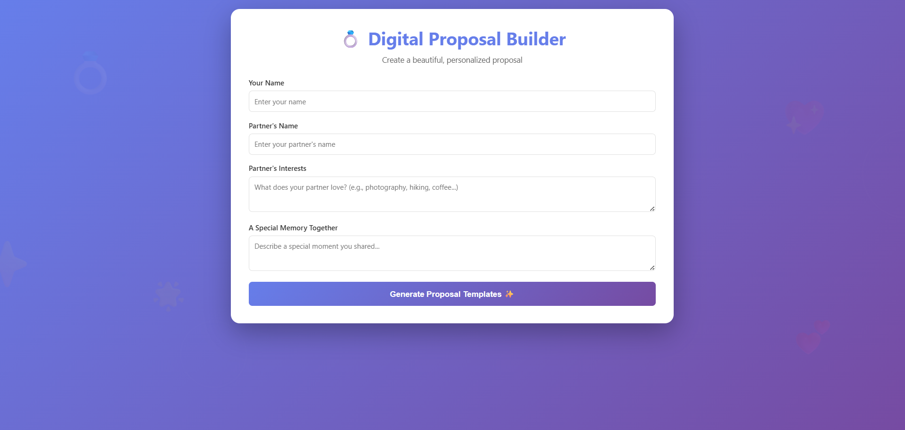
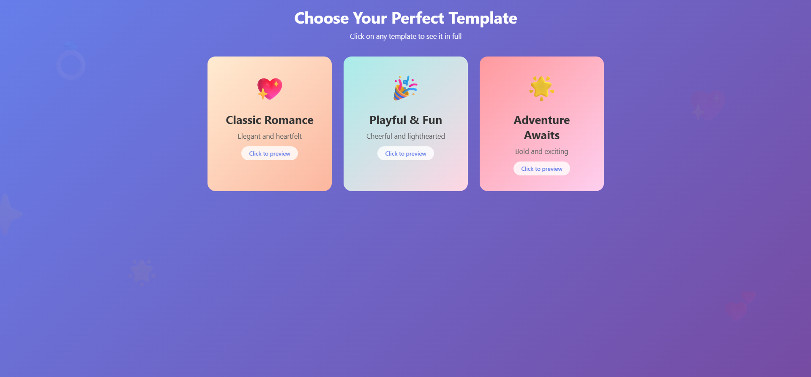
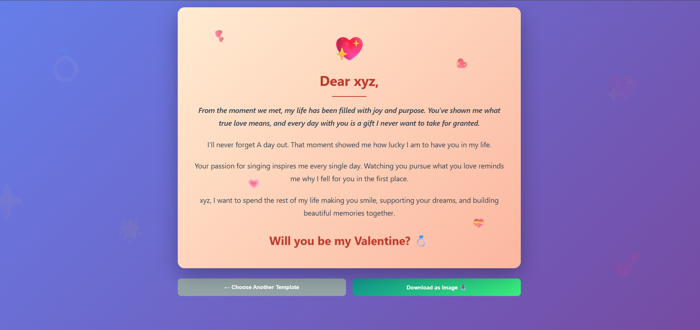

# 💍 Digital Proposal Builder

Create beautiful, personalized proposal webpages in minutes!

## 🌟 Live Demo
👉 [Try it here](https://rishabh-afk828.github.io/Proposal-Builder/)

## 📖 About
A simple web application that helps people create romantic, personalized proposal messages with beautiful templates. No backend required - 100% frontend solution!

## ✨ Features
- 🎨 3 Beautiful Templates (Romantic, Playful, Adventurous)
- 💝 Personalized Content Generation
- 📱 Mobile Responsive
- 🚀 No Backend Required

## 🛠️ Tech Stack
- HTML5
- CSS3
- JavaScript (Vanilla)

## 🚀 How to Use
1. Visit the [live site](https://rishabh-afk828.github.io/Proposal-Builder/)
2. Fill in the form with your details
3. Choose your favorite template
4. Generate a shareable link
5. Send it to your partner!

## 💻 Local Setup
```bash
# Clone the repository
git clone https://github.com/RISHABH-afk828/Proposal-Builder.git

# Navigate to the project directory
cd Proposal-Builder

# Open index.html in your browser
# No installation required!
```

## 📂 Project Structure
```
Proposal-Builder/
├── index.html      # Main HTML file
├── style.css       # Styling and animations
└── script.js       # JavaScript logic
```

## 🎯 Future Enhancements
- [ ] Add more templates
- [ ] Custom color themes
- [ ] Photo upload feature
- [ ] Music integration
- [ ] Response tracking (Yes/No)

## 📸 Screenshots




## 👨‍💻 Author
**Rishabh**
- GitHub: [@RISHABH-afk828](https://github.com/RISHABH-afk828)

## 📄 License
This project is open source and available under the MIT License.

## 🤝 Contributing
Contributions, issues, and feature requests are welcome!

---
Made with ❤️ for making proposals special